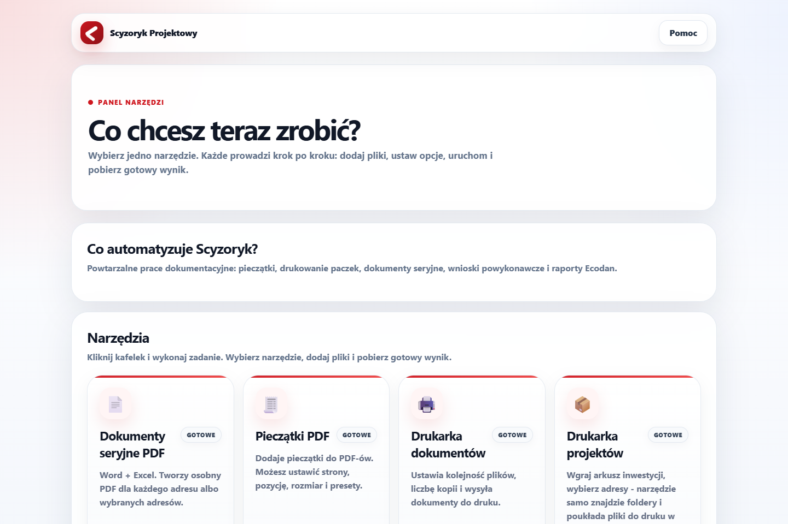
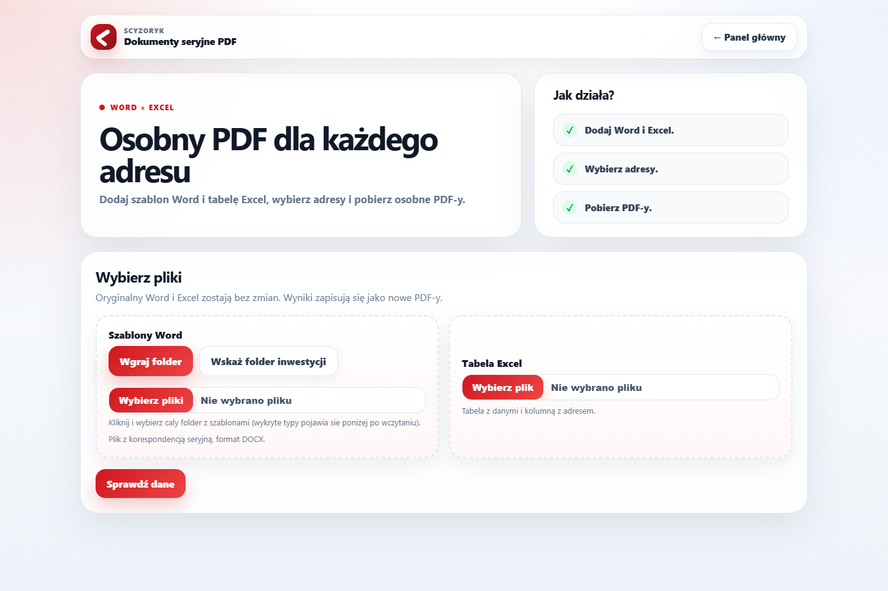
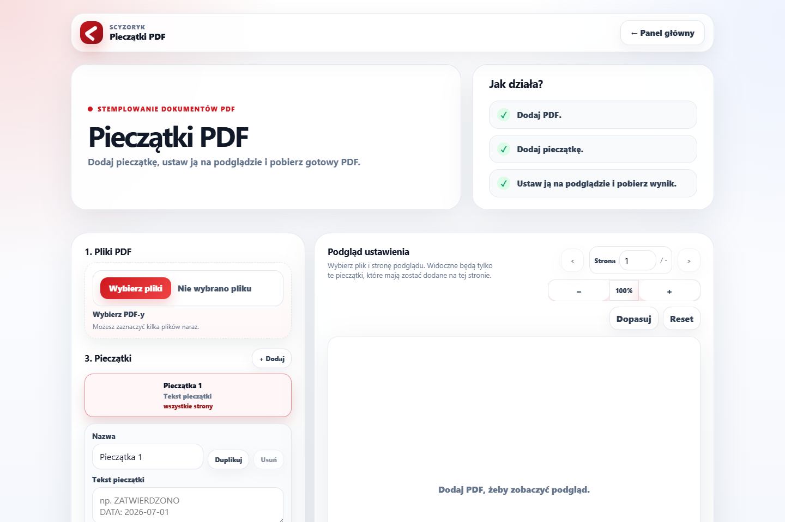
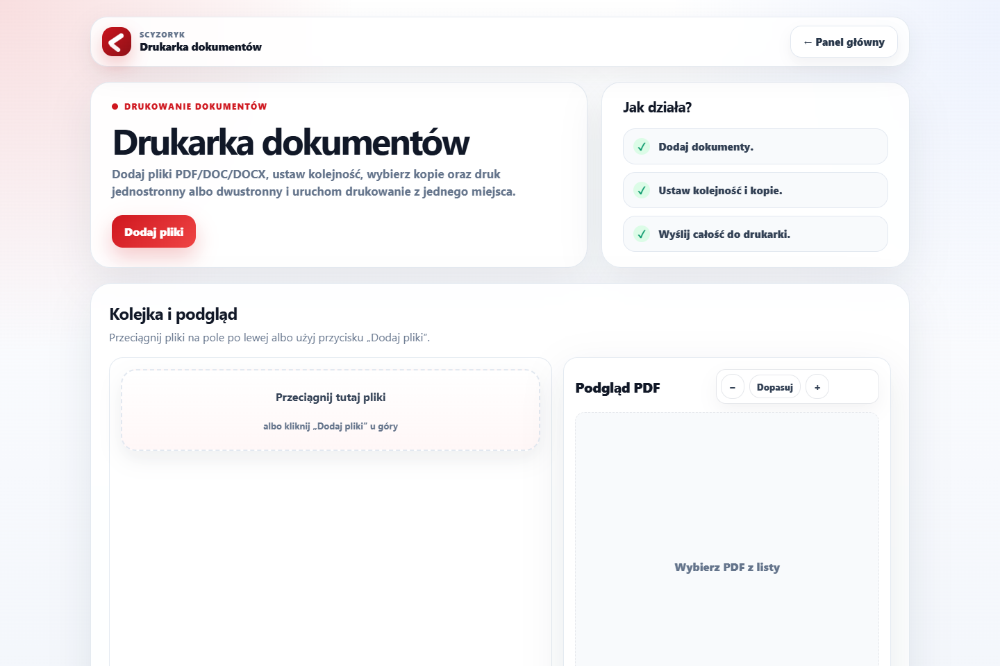
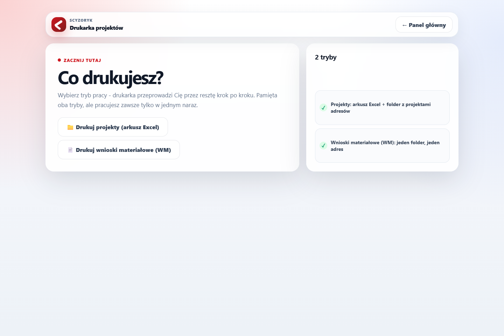
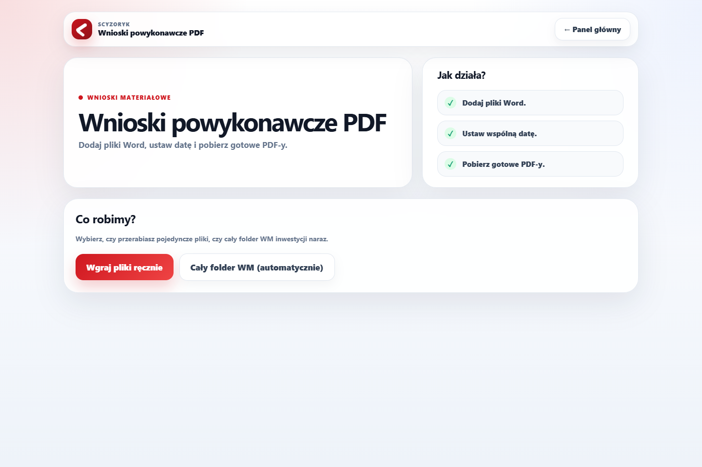
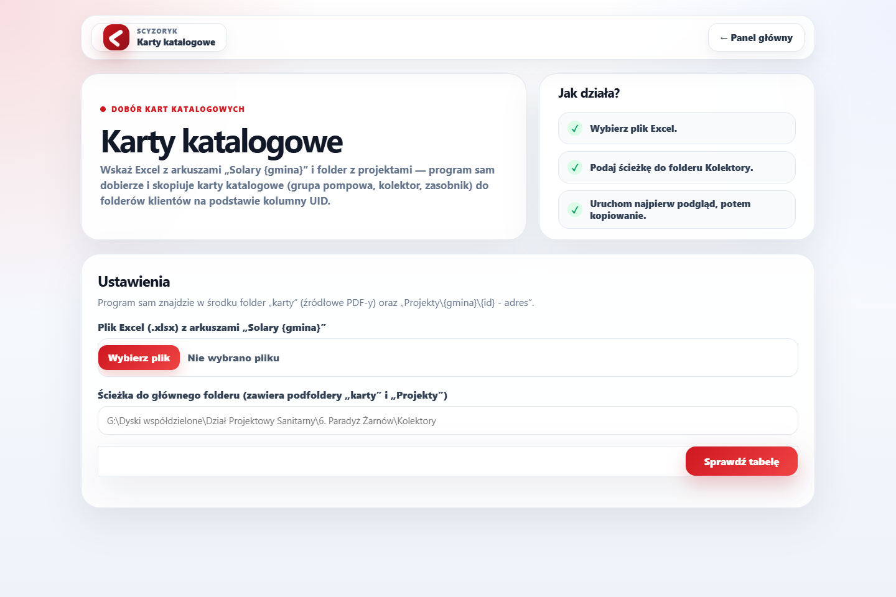
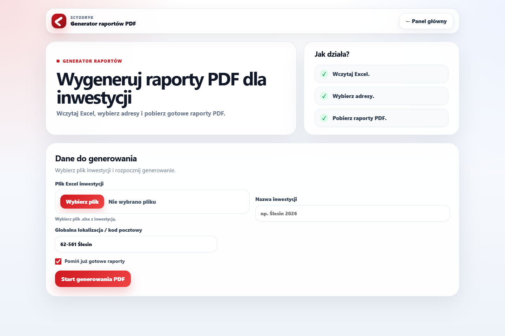
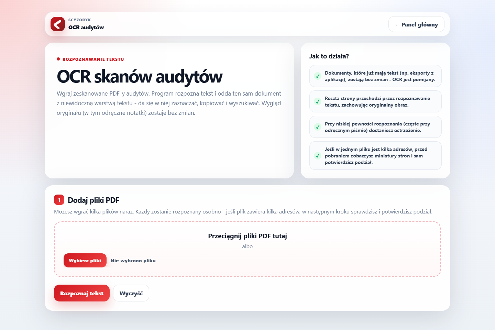
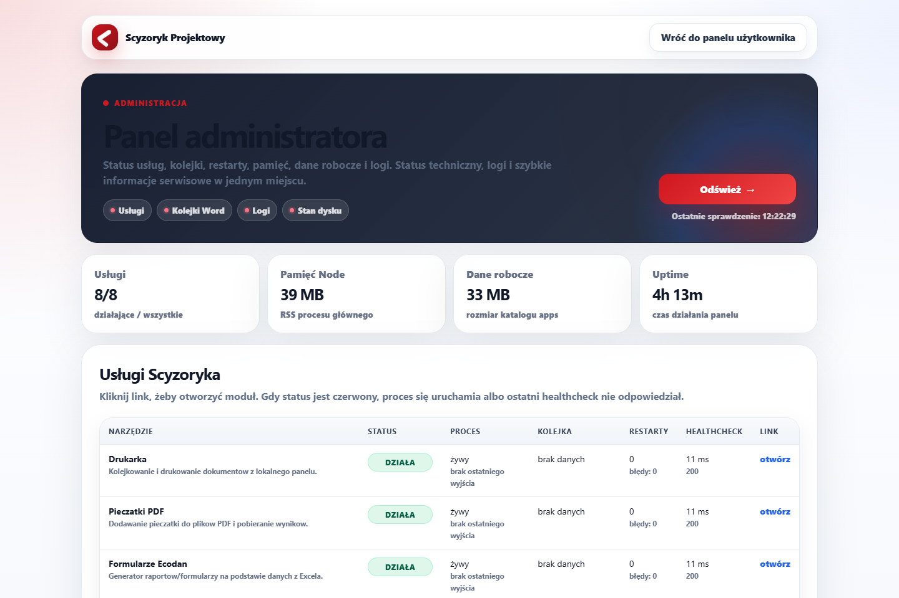

# Instrukcja instalacji na nowym komputerze

Ten dokument prowadzi krok po kroku przez pobranie Scyzoryka Projektowego z GitHuba i
uruchomienie go na kolejnym komputerze — bez zakładania, że coś wcześniej tu było
instalowane. Repozytorium jest **prywatne**, więc krok pobrania wymaga konta GitHub z
dostępem nadanym przez właściciela repo.

> Projekt jest w aktywnym rozwoju (patrz `README.md`) — struktura plików może się jeszcze
> zmieniać. Ta instrukcja opisuje **sposób pobrania i uruchomienia**, nie zamraża
> struktury repo.

## 1. Czego potrzebujesz na nowym komputerze

| Wymaganie | Po co | Jak sprawdzić |
|---|---|---|
| Windows | Skrypty `.cmd`/`.ps1`, drukowanie, Word COM | — |
| **Node.js** (LTS, np. 20.x lub nowszy) | Uruchamia cały panel i wszystkie narzędzia | otwórz PowerShell/CMD i wpisz `node -v` |
| **Microsoft Word** zainstalowany lokalnie | Wymagany tylko dla „Dokumenty seryjne” i „Wnioski powykonawcze” (automatyzacja przez Word COM) | — |
| Dostęp do repo na GitHubie | Repo jest prywatne | zaproszenie/uprawnienia od właściciela |
| (Opcjonalnie) klucz Google Cloud Vision | Tylko dla „OCR audytów” — bez niego reszta narzędzi działa normalnie | zmienna `OCR_VISION_API_KEY`, patrz krok 5 |

`STARTUJ-SCYZORYK.cmd` **sam instaluje zależności npm** (w tym przeglądarkę Chromium
dla Playwrighta, używaną przez „Formularze Ecodan”) — nie trzeba nic instalować ręcznie
poza samym Node.js.

## 2. Pobranie repozytorium z GitHuba

Dwie opcje — wybierz jedną.

### Opcja A: zwykłe pobranie ZIP-a (najprościej, bez instalowania Gita)

1. Zaloguj się na GitHubie kontem, które ma dostęp do repo
   `mcyniak/scyzoryk-projektowy`.
2. Wejdź na stronę repozytorium: `https://github.com/mcyniak/scyzoryk-projektowy`.
3. Kliknij zielony przycisk **`Code`** w prawym górnym rogu listy plików, a potem
   **`Download ZIP`**.
4. Rozpakuj pobrane archiwum w wybrane miejsce na dysku, np.
   `C:\Scyzoryk\scyzoryk-projektowy`.

Ta opcja **nie pozwala później łatwo pobierać aktualizacji** — przy każdej nowej wersji
trzeba pobrać ZIP jeszcze raz i podmienić pliki. Do jednorazowego postawienia narzędzia
na komputerze, który go wcześniej nie miał, w zupełności wystarczy.

### Opcja B: `git clone` (polecane, jeśli będziesz aktualizować)

1. Zainstaluj [Git for Windows](https://git-scm.com/download/win), jeśli go nie ma.
2. Otwórz PowerShell w miejscu, gdzie ma powstać folder projektu, i wykonaj:

   ```powershell
   git clone https://github.com/mcyniak/scyzoryk-projektowy.git
   cd scyzoryk-projektowy
   ```

3. Git poprosi o zalogowanie do GitHuba (przeglądarka albo token) — repo jest prywatne.

Dzięki tej opcji kolejne aktualizacje to tylko `git pull` w folderze projektu.

## 3. Pierwsze uruchomienie

W folderze repo (ten, w którym jest plik `STARTUJ-SCYZORYK.cmd`) kliknij na niego
dwukrotnie. Skrypt automatycznie:

1. zamyka osierocone procesy `node.exe` z poprzednich uruchomień,
2. sprawdza, czy jest zainstalowany Node.js (jeśli nie — wypisze komunikat i przerwie),
3. instaluje zależności każdej aplikacji w `apps/*` (`npm ci`/`npm install`, plus
   przeglądarkę Chromium dla Playwrighta) — **pierwsze uruchomienie trwa dłużej** z tego
   powodu,
4. uruchamia `npm run check` (sprawdzenie składni wszystkich plików `.js`/`.ps1`),
5. startuje panel pod adresem `http://127.0.0.1:3000`.

Jeśli coś pójdzie nie tak przy instalacji zależności (np. uszkodzony `node_modules` po
przerwanej instalacji), uruchom `NAPRAW-ZALEZNOSCI.cmd` — usuwa `node_modules` i
`package-lock.json` w każdej aplikacji i instaluje wszystko od zera, po czym można
znowu odpalić `STARTUJ-SCYZORYK.cmd`.

Po starcie otwórz w przeglądarce `http://127.0.0.1:3000` — powinien pojawić się panel
główny:



## 4. Narzędzia dostępne z panelu

Każdy kafelek na panelu głównym prowadzi do osobnego narzędzia, działającego na własnym
porcie (przeglądarka łączy się z nim bezpośrednio, panel niczego nie proxuje):

| Narzędzie | Port | Zrzut ekranu |
|---|---|---|
| Dokumenty seryjne PDF | 3004 |  |
| Pieczątki PDF | 3002 |  |
| Drukarka dokumentów | 3001 |  |
| Drukarka projekty | 3010 |  |
| Wnioski powykonawcze PDF | 3005 |  |
| Karty katalogowe | 3006 |  |
| Formularze Ecodan | 3003 |  |
| OCR audytów | 3011 |  |

Panel techniczny (status procesów, restarty, logi) jest pod `/admin.html`:



## 5. Rzeczy, które trzeba doustawić na nowym komputerze

- **OCR audytów** wymaga zmiennej środowiskowej `OCR_VISION_API_KEY` (klucz Google
  Cloud Vision) — bez niej to jedno narzędzie nie zadziała, reszta panelu działa
  normalnie. Ustaw ją przed startem, np. w PowerShell:

  ```powershell
  $env:OCR_VISION_API_KEY = "tu-wklej-klucz"
  .\STARTUJ-SCYZORYK.cmd
  ```

  Żeby nie wpisywać tego za każdym razem, ustaw zmienną na stałe w Windows
  (Panel sterowania → Zmienne środowiskowe) albo w skrócie startowym. Opcjonalnie
  `OCR_VISION_REGION=eu`, żeby żądania szły przez europejski endpoint Google.
- **Dokumenty seryjne / Wnioski powykonawcze** wymagają lokalnie zainstalowanego
  Microsoft Worda (automatyzacja przez Word COM) — bez niego te dwa narzędzia zwrócą
  błąd przy generowaniu, reszta panelu działa normalnie.
- Wszystko nasłuchuje wyłącznie na `127.0.0.1` — to narzędzie **lokalne**, nie jest
  pomyślane do wystawienia w sieci. Jeśli inny port jest zajęty, porty każdej aplikacji
  da się nadpisać zmiennymi środowiskowymi (`DRUKARKA_PORT`, `PIECZATKI_PORT`,
  `FORMULARZE_PORT`, `SERYJNE_PORT`, `WNIOSKI_PORT`, `KARTY_PORT`,
  `DRUKARKA_PROJEKTY_PORT`, `OCR_AUDYTOW_PORT`, `PORT` dla samego panelu).

## 6. Aktualizacja później

Jeśli repo pobrano przez `git clone` (opcja B): w folderze projektu

```powershell
git pull
.\STARTUJ-SCYZORYK.cmd
```

`STARTUJ-SCYZORYK.cmd` sam douzupełni nowe/zmienione zależności npm przy kolejnym
starcie.

Jeśli repo pobrano jako ZIP (opcja A): pobierz nowy ZIP i podmień pliki w folderze
projektu (najlepiej zachowując `apps/*/data`, jeśli są tam już jakieś zadania/pliki
robocze, których nie chcesz stracić).
